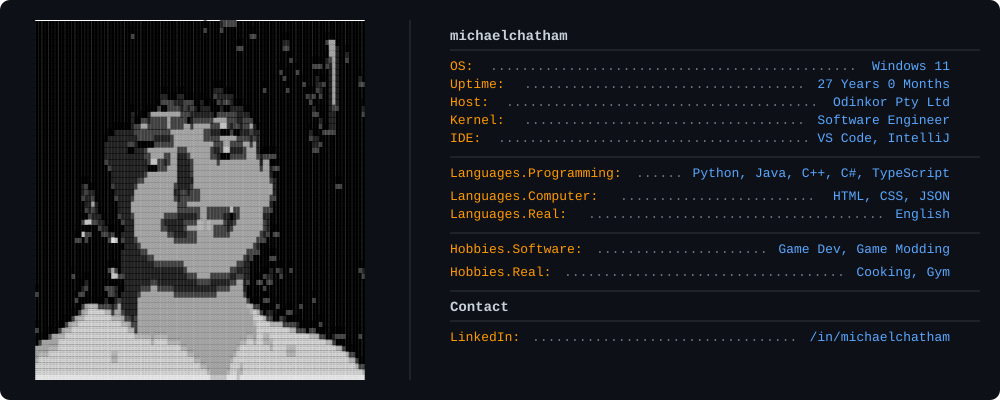

  

## About Me

Software Engineer at Odinkor Pty Ltd and Computer Science graduate from RMIT University with 4+ years of programming experience. Throughout my career, I've specialized in building full-stack web applications, developing immersive AR/VR experiences, and integrating AI/LLM technologies to create intelligent, user-centric solutions.

My technical journey spans from winning the People's Choice Award at the Boeing Technical Hackathon 2022 for developing aerospace manufacturing tools, to creating augmented reality applications for competitive robotics, to building enterprise-level clinic management systems. I'm passionate about leveraging emerging technologies, particularly conversational AI and mixed reality, to solve real-world problems and improve user experiences.

Currently focused on <strong>Vivley</strong>, an AI-powered travel platform that aims to revolutionize how people search for and book hotels through natural language conversations. I'm always exploring new frameworks, tools, and methodologies to stay up to date with software development.

## Tech Stack

### Languages

  
  
  
  
  
  
  
  

### Web Development

**Frontend**

  
  
  

**Backend**

  
  
  <picture>
    <source media="(prefers-color-scheme: dark)" srcset="https://cdn.simpleicons.org/fastify/FFFFFF">
    <source media="(prefers-color-scheme: light)" srcset="https://cdn.simpleicons.org/fastify/000000">
    
  </picture>

### Databases & Backend Services

  
  

### Cloud & DevOps

  
  
  

### AI & APIs

  <picture>
    <source media="(prefers-color-scheme: dark)" srcset="https://cdn.simpleicons.org/openai/FFFFFF">
    <source media="(prefers-color-scheme: light)" srcset="https://cdn.simpleicons.org/openai/000000">
    
  </picture>

### Game Development & AR/VR

  

## Awards & Achievements

<table>
<tr>
<td width="100%">

### 🏆 People's Choice Award
**Boeing Technical Hackathon 2022**

Led development of an innovative search and analysis tool designed specifically for aerospace engineers working with autoclave manufacturing processes. The application enables engineers to efficiently query historical autoclave run data, analyze temperature and pressure profiles across multiple runs, and quickly retrieve machine operational history for quality control and troubleshooting purposes. The solution streamlined the investigation process for manufacturing anomalies by consolidating previously scattered data sources into a single, intuitive interface.

</td>
</tr>
</table>

## Featured Projects

<table>
<tr>
<td width="100%">

### ✈️ Vivley AI Powered Travel Platform
🚀 Currently Building

A travel booking platform that reimagines hotel search and booking through conversational AI. Built to address the pain points of traditional Online Travel Agencies (OTAs), Vivley enables users to search using natural language queries, refine their preferences through an intelligent chat interface, and complete bookings directly within the platform without external redirects. The system leverages OpenAI's API to understand complex travel requirements, filters through real-time hotel inventory, and provides personalized recommendations based on user preferences. Features include real-time availability checking, price comparison, dynamic filtering through conversation, and seamless booking confirmation.

**Tech Stack:** Fastify • TypeScript • React • Next.js • OpenAI API • PostgreSQL (Supabase) • Tailwind CSS

</td>
</tr>
</table>

<table>
<tr>
<td width="100%">

### 🎮 GameSight AR Application for RoboCup SPL
✅ Completed

An immersive augmented reality spectator application built for Meta Quest 3 that transforms how audiences experience RoboCup Standard Platform League matches. The application overlays real-time match statistics, player positions, and game analytics directly onto the physical soccer field through the headset's passthrough view. Implemented advanced features including controller-based field calibration for precise alignment, passthrough depth mapping to ensure proper occlusion of virtual elements behind physical objects, and a computer vision system using Unity Sentis for automatic field boundary detection. The application processes live game data feeds and renders dynamic 3D visualizations that update in real-time as the match progresses, providing viewers with enhanced insight into robot positioning, ball tracking, and team strategies.

**Tech Stack:** Unity (C#) • Meta XR SDK • Meta Interaction SDK • Sentis (Unity ML) • Passthrough Depth APIs

</td>
</tr>
</table>

<table>
<tr>
<td width="100%">

### 🐾 PetCare Vet Clinic Management System
✅ Completed

A full-stack web application designed to streamline veterinary clinic operations and appointment management. The system features a fully normalized relational database schema optimized for clinic workflows, including patient records, appointment scheduling, veterinarian availability, and treatment history. Implemented database version control using Flyway migrations to ensure consistent schema evolution across development and production environments. The application provides real-time availability tracking for veterinarians, prevents double-booking through transaction management, and includes features for patient check-in, medical record management, and appointment notifications. Built with a focus on data integrity, the system uses JDBC for direct database access with optimized query performance.

**Tech Stack:** Spring Boot • JDBC • Flyway • PostgreSQL • Bootstrap • Maven

</td>
</tr>
</table>

## Connect With Me

  

💡 *"A programmer is heading out to the grocery store, so his wife tells him "get a gallon of milk, and if they have eggs, get a dozen." He returns with 13 gallons of milk."*

